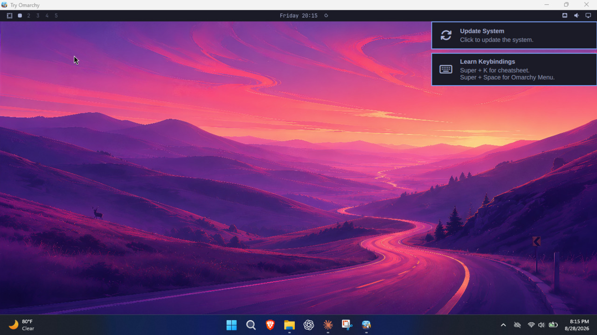
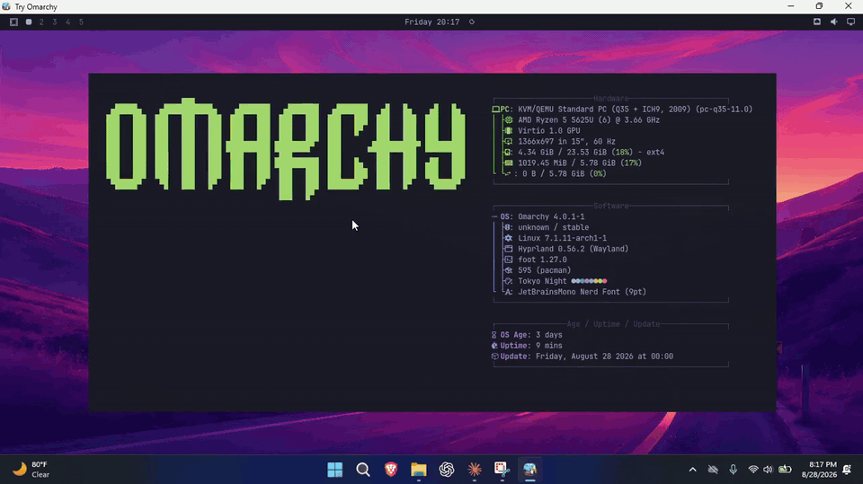
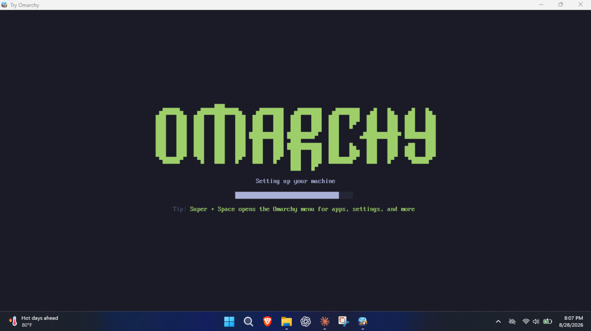
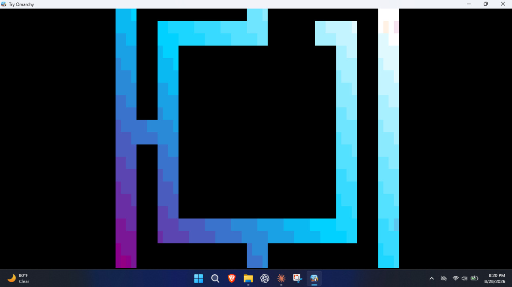

# Try Omarchy for Windows

Run the full [Omarchy](https://omarchy.org) desktop in a window on Windows 11. No VMware, no VirtualBox, no dual boot: QEMU on the Windows Hypervisor Platform (WHPX), a prebuilt Arch image with Omarchy baked in, and the desktop rendered on your actual GPU (virgl + Venus Vulkan via [WINQ-EMU](https://github.com/cmspam/winq-emu)) with CPU rendering as the automatic fallback. No partitions, no bootloader, no changes to your Windows install: everything lives in one folder, `%LOCALAPPDATA%\TryOmarchy`, and deleting that folder is the uninstall.

Download, boot, Hyprland.





**Status: working end to end on real hardware.** One app switches on Windows' virtualization, downloads the GPU runtime and the image, boots, and supervises; the desktop renders on the GPU and falls back to CPU rendering automatically. Landing page: [tryomarchy.com](https://tryomarchy.com). See the [changelog](CHANGELOG.md) for release history.

## What works today

- **The full Omarchy 4.0.2 desktop**: Hyprland, the bar, notifications, all 22 themes, the screensavers. On our mid-range Ryzen 5 test laptop the desktop is up about 6 seconds after launch, and every launch after setup goes straight there. No Linux login screens, no console text, branded window.
- **GPU acceleration**: Hyprland renders on the host GPU via virgl, `vulkaninfo` shows Venus, smooth video and audio (verified on a Radeon iGPU laptop); `-cpu host` (AVX2 and all) via WINQ-EMU's patched WHPX.
- **One app, zero prerequisites**: `TryOmarchy.exe` (~8 MB, no console window). First run sets the machine up itself: switches on Windows' Hypervisor Platform (one permission prompt, one restart), then downloads the GPU runtime and the image SHA256-verified and boots into Omarchy's setup form. Once setup is complete it keeps a stable launcher under `%LOCALAPPDATA%\TryOmarchy` and can add optional Start-menu and Desktop shortcuts. After that it supervises everything: GPU/CPU auto-detect, the known WHPX launch wedge, in-guest reboot relaunch, poweroff cleanup.
- **Feels like an app, not a VM**: the window is branded "Try Omarchy", the Windows key acts as Super only while the window is focused (Start menu and Win+Shift+S keep working everywhere else), Ctrl+Alt+F goes fullscreen.
- **Two-way text clipboard sharing** between Windows and Omarchy (own compositor-native bridge over wl-clipboard, no SPICE) and **folder sharing** (`-Share <folder>`, virtio-9p on the GPU stack). File clipboard and drag-and-drop are not supported; use folder sharing to move files.
- First boot offers an instant trial account or Omarchy's normal personalized account setup, with SDDM autologin after either path. Instant mode keeps `omarchy` as both the local username and lock-screen password, shows that on the setup splash, and repeats it once on the first desktop. Sudo remains passwordless in this disposable local trial.
- Reproducible x86_64 guest image build (containerized, package-locked, pinned Omarchy revision) and a headless QMP control plane for automated testing.

See [app compatibility](docs/COMPATIBILITY.md) for package support and current VM limitations.

| First run | Screensaver |
|---|---|
|  |  |

## Essential keys

- **Windows key** acts as Super, but only while the Try Omarchy window is focused. Everywhere else it stays your normal Windows key, so the Start menu and Win+Shift+S keep working.
- **Ctrl+Alt+F** fullscreens the VM window itself on your Windows desktop (SUPER+F, below, is the in-Omarchy one).
- **Ctrl+Alt+G** grabs or releases raw keyboard input. If the host steals a shortcut you meant for Omarchy, grab first. Same trick if you're driving the VM over VNC or RDP and focus gets weird.
- Hyprland is keyboard-first by design and the first hour is the adjustment period. Learn two keys and the rest follows: **SUPER+SPACE** opens the Omarchy menu, **SUPER+K** opens the keybinding viewer with every binding and its description. The everyday starters: SUPER+RETURN opens a terminal, SUPER+W closes the focused window, SUPER+F fullscreens it.

## Architecture

Same recipe as the excellent macOS [try-omarchy](https://github.com/themartiano/try-omarchy) (QEMU + Apple Hypervisor Framework + VirGL), translated to Windows:

| Piece | macOS (try-omarchy) | This project |
|---|---|---|
| Hypervisor | Hypervisor.framework | Windows Hypervisor Platform (WHPX) |
| Guest image | ARM64 Arch + Omarchy | x86_64 Arch + Omarchy |
| Graphics | VirGL | virtio-gpu virgl + Venus Vulkan (WINQ-EMU); llvmpipe fallback |
| App shell | Swift/AppKit | Go: one console-less `TryOmarchy.exe` (PowerShell scripts remain as a fallback path) |

WHPX works on Windows Home and Pro (it's the same platform WSL2 rides on), so no Hyper-V role is required. If WSL2 runs on your machine, you're set.

Proven boot recipe: `-accel whpx -machine q35 -cpu qemu64`, direct kernel boot (vmlinuz + initramfs + raw ext4 rootfs on virtio-blk), all-virtio devices, DirectSound audio. See [docs/FINDINGS.md](docs/FINDINGS.md) for the details and the traps.

## Try it

Download [TryOmarchy.exe](https://github.com/tsouth89/try-omarchy-windows/releases/latest/download/TryOmarchy.exe) (~8 MB, [SHA256](https://github.com/tsouth89/try-omarchy-windows/releases/latest/download/TryOmarchy.exe.sha256)) and open it. First run sets the machine up by itself: Windows asks permission to switch on the Hypervisor Platform and restarts once, then the app pulls the GPU runtime (a portable [WINQ-EMU](https://github.com/cmspam/winq-emu) tree, ~46 MB) and the Omarchy image (~1.4 GB), everything SHA256-verified. Choose the instant trial account to go straight to the desktop, or use Omarchy's setup form to choose your own account. Every launch after goes straight to the desktop.

After the first successful setup, Try Omarchy offers optional Start-menu and Desktop shortcuts. They point to a stable copy of the signed launcher in `%LOCALAPPDATA%\TryOmarchy`, so the original download can be moved or deleted. Opening a newer downloaded release refreshes that stable copy.

Try Omarchy checks for updates when it starts. Release metadata is signed with a separate Ed25519 update key, and its authenticated hashes cover the signed launcher and the guest payload manifest. New files are fully downloaded and verified before they replace anything. The previous launcher, bundled runtime, and factory image remain available until the updated VM reaches a healthy boot, while `vm\disk.raw` is left untouched. If the first boot fails or is interrupted, the next launch restores the previous files automatically. Use `-no-update` when an offline or version-pinned launch is required.

Already have WINQ-EMU at `C:\WINQ-EMU`, or stock QEMU from the old bootstrap? The app prefers what's installed and downloads nothing extra.

Prefer to build the app yourself? Any machine with Go, then run the exe on Windows:

```
git clone https://github.com/tsouth89/try-omarchy-windows
cd try-omarchy-windows/app
GOOS=windows GOARCH=amd64 go build -trimpath -ldflags "-H windowsgui -s -w" -o TryOmarchy.exe .
```

The launcher embeds and pins the SHA256 digest of the default release's
`SHA256SUMS` file. It verifies an existing cache before trusting it, records a
manifest-bound install receipt for fast offline launches, and only promotes
fully written rootfs and writable-disk staging files into place. When publishing
a new image release, update `defaultReleaseURL`, `defaultSumsSHA256`, and the
matching fixture in `app/testdata`, plus `currentVersion` in `app/update.go`.
Interrupted payload transfers resume from their `.part` files when the server
supports byte ranges, then the complete file is SHA256-verified before use.
Custom release URLs must be paired with the
trusted manifest digest via `-sums-sha256`.

### SSH and port forwarding

Nothing listens by default. To reach Omarchy from Windows tools, forward a
loopback port:

```
TryOmarchy.exe -ssh 2222
```

That forwards `127.0.0.1:2222` to Omarchy's sshd for this session only and
asks the guest to start sshd for that boot. Nothing on your network can reach
it. Your `~/.ssh/id_ed25519.pub` (or `id_ecdsa.pub`, `id_rsa.pub`) is authorized
for the Omarchy account automatically; pass `-ssh-key PATH` to pick another
public key, or use none and log in with the password you chose in Omarchy.
Then:

```
ssh -p 2222 <omarchy-user>@127.0.0.1
```

The same alias works for `scp`, Git, and VS Code Remote SSH. Other services
use `-forward tcp:8080:80` or `-forward udp:5000:5000` (repeatable); the guest
service must listen on its network interface, not only on its own localhost.
From Omarchy, `10.0.2.2:<port>` reaches a service on Windows without any
mapping. Key-only or permanent SSH is Omarchy's own choice: run
`omarchy-setup-security-sshd` inside the guest. A fresh disk (`-fresh`) gets a
new host key, so remove the old `[127.0.0.1]:2222` entry from `known_hosts`
if ssh complains.

### Taking your setup to a real Omarchy install

Inside Omarchy, run `try-omarchy-export`. It writes one archive with your
configuration, theme, and the packages you added, to the shared Windows folder
when one is mounted (`-Share`) or to your home folder otherwise. On the real
install, extract it and run the `restore.sh` inside. Keys, password stores,
and browser profiles are deliberately left out. See
[`docs/MIGRATION.md`](docs/MIGRATION.md).

### Offline portable mode

The launcher also accepts `-portable` for an experimental, persistent USB
layout. In this mode it reads an authenticated release payload beside the
executable, makes no setup-time network requests, stores all guest state on the
removable drive, and uses a compact QCOW2 overlay that survives Windows drive
letter changes and works on exFAT. The independently pinned `SHA256SUMS` digest,
install receipts, cancellation handling, and atomic file publication apply to
the portable path too.

See [`docs/PORTABLE_USB.md`](docs/PORTABLE_USB.md) for the expected layout and
host requirements. Bundle preparation and additional host launchers are kept
out of this core Windows change so they can be reviewed separately.

Or skip the app and drive QEMU from PowerShell: `scripts\bootstrap.ps1` then `scripts\launch-omarchy.ps1` (elevated).

## FAQ

### Isn't this just QEMU in disguise?

Yes, and that's the point. QEMU on WHPX is the best virtualization stack Windows has, but wiring it up yourself (machine type, virtio devices, GPU forwarding, input handling, the known launch wedges) is a weekend project on its own. The app does that wiring for you, supervises the VM, and keeps everything in one folder you can delete.

### Why is the download only ~8 MB?

TryOmarchy.exe is just the launcher. On first run it fetches the GPU runtime (~46 MB) and the Omarchy image (~1.4 GB), SHA256-verifies both, and caches them in `%LOCALAPPDATA%\TryOmarchy`. After that, launches work offline.

### Why not just use a live USB?

A live USB means rebooting away from your machine and forgetting everything on shutdown. This runs in a window next to your actual work, keeps your state between sessions, and renders on your real GPU.

### What are the instant trial credentials?

The local trial account is named `omarchy` and its lock-screen password is `omarchy`. Sudo does not ask for a password in instant trial mode. Try Omarchy does not enable SSH or expose inbound network ports unless you ask for a forward with `-ssh` or `-forward`, and those bind to `127.0.0.1` only.

### How do I remove Try Omarchy?

Delete `%LOCALAPPDATA%\TryOmarchy`. That removes the launcher, runtime, image, and your writable virtual disk. If you created Windows shortcuts, remove them from the Start menu or Desktop like any other shortcut. The original downloaded `TryOmarchy.exe` can be deleted separately.

### I have the full Hyper-V feature set installed. Will it conflict?

WHPX and Hyper-V share the same Windows hypervisor and are designed to coexist. We have not yet validated every Try Omarchy feature on a machine with the full Hyper-V feature set enabled, so please open an issue if you hit anything odd.

## Repository layout

- `app/` — the app itself: one Go exe covering the launcher, supervisor, first-run download, focus-scoped Win-key forwarding, and the host side of the clipboard bridge
- `runtime-build/`: the source-locked Windows QEMU runtime build, verification, licenses, and provenance tooling
- `scripts/` — PowerShell path plus QMP tooling (screendump, send-key, WHPX smoke test)
- `guest-build/` — patches on jorge's guest builder that produce our image, plus build instructions
- `docs/FINDINGS.md` — technical findings, gotchas, and their fixes
- `docs/RELEASING.md` - the authenticated two-phase build, signing, and publishing process

The guest image (Omarchy 4.0.2, all upstream themes, screensavers, autologin, clipboard bridge) is built from [jorge-huxley/try-omarchy-win](https://github.com/jorge-huxley/try-omarchy-win)'s `win` branch guest builder (`guest/build-container.sh`, needs Docker on Linux) — an x86_64 retarget of the upstream try-omarchy build system — with the patches in `guest-build/` applied. Images are not committed; setup downloads the latest release artifact, or build your own.

## Credit where due

This project stands on a lot of shoulders:

- [Omarchy](https://github.com/basecamp/omarchy) by DHH / Basecamp — the desktop this is all about
- [try-omarchy](https://github.com/themartiano/try-omarchy) by Eduardo (themartiano) — the original macOS app and the architecture this follows
- [try-omarchy-win](https://github.com/jorge-huxley/try-omarchy-win) by Jorge Silva — the x86_64 guest builder retarget and the proven WHPX boot recipe this project reuses
- [WINQ-EMU](https://github.com/cmspam/winq-emu) by cmspam — Venus Vulkan GPU forwarding for QEMU on Windows, the graphics path
- [omarchy-windows-hyperv-gpu](https://github.com/Chainfire/omarchy-windows-hyperv-gpu) by Chainfire — prior art proving GPU-accelerated Omarchy on Windows, plus the QEMU 11 WHPX interrupt findings
- [dockur/windows](https://github.com/dockur/windows) — the Windows-in-Docker environment this is developed and tested in

Open to collaboration — if you're working on any of this, get in touch.

## License

Scripts and docs in this repo: [MIT](LICENSE). Omarchy and the guest image contents carry their own licenses.
