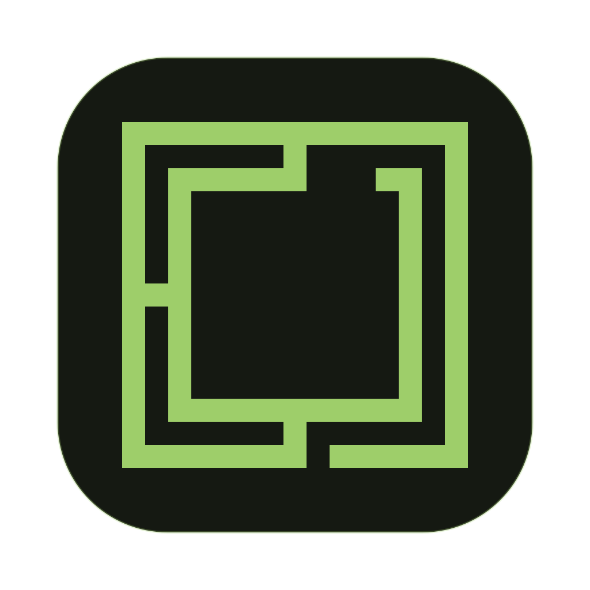
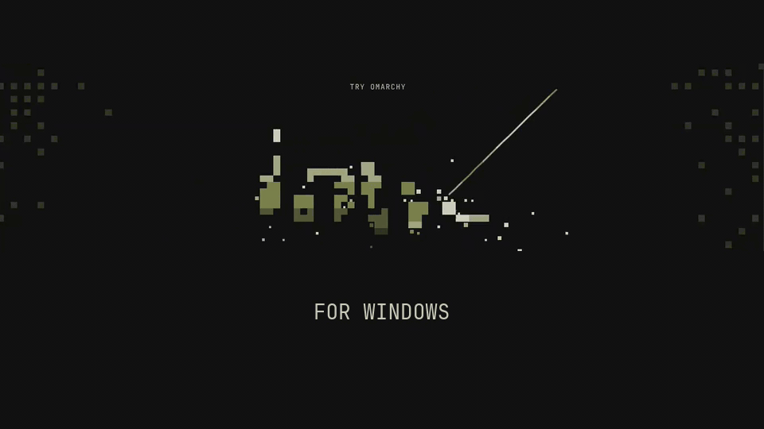

<p align="center">
  
</p>

<h1 align="center">Try Omarchy for Windows</h1>

<p align="center">The full Omarchy desktop, running in a window on your Windows PC.</p>

<p align="center">
  <strong><a href="https://github.com/omacom/try-omarchy-windows/releases/latest/download/TryOmarchy.exe">Download TryOmarchy.exe</a></strong>
  &nbsp;·&nbsp; <a href="https://github.com/omacom/try-omarchy-windows/releases/latest/download/TryOmarchy.exe.sha256">SHA256</a>
  &nbsp;·&nbsp; <a href="https://github.com/omacom/try-omarchy-windows/releases/latest">Latest release</a>
</p>

<p align="center">Windows 10 or 11 · x86_64 · Hardware virtualization required</p>

<picture>
  <source media="(prefers-reduced-motion: reduce)" srcset="docs/images/try-omarchy-windows-still.jpg">
  
</picture>

Try Omarchy runs [Omarchy](https://omarchy.org) in a virtual machine. You can explore its apps, themes, and keyboard-first workflow without repartitioning your drive or leaving Windows. Your Linux files persist between sessions.

<a id="try-it"></a>

## Get started

1. **Download and open [TryOmarchy.exe](https://github.com/omacom/try-omarchy-windows/releases/latest/download/TryOmarchy.exe).** The launcher is about 10 MB and is signed by Brandon South. You can check the signature in the file's **Properties > Digital Signatures** tab.
2. **Choose where to keep Omarchy.** The default is `%LOCALAPPDATA%\TryOmarchy`. Setup may enable Windows Hypervisor Platform and request one restart. It then downloads and verifies the graphics runtime and guest image, about 2 GB in total.
3. **Choose an instant trial or set up your own account.** Once the desktop opens, press **Super+Space** for the Omarchy menu and **Super+K** to see the keybindings.

See the [user guide](docs/USER-GUIDE.md) for updates, shortcuts, storage, settings, and removal.

## What you can do

- **Use the whole desktop.** Hyprland, Omarchy's apps, themes, menus, notifications, and screensavers run inside the window.
- **Move between Windows and Omarchy.** Share text, images, files, and folders through the clipboard and the optional shared folder. Drop Windows files onto an open Files folder or onto an app, such as a browser upload area.
- **Use your hardware.** Supported graphics drivers can render through VirGL and Venus Vulkan. The launcher falls back to CPU rendering when that path is unavailable.
- **Make it yours.** Choose a display, audio devices, resource profile, and optional fullscreen or direct-launch shortcuts. Windows Hello for guest `sudo` is available for personalized accounts.
- **Keep your work.** The guest disk persists, with backup, restore, reset, and update controls.

[Watch the Windows demo](https://tryomarchy.com/images/try/windows.mp4) or read the [compatibility guide](docs/COMPATIBILITY.md) for the current hardware and application limits.

## Before you start

- You need a **64-bit Windows 10 or 11 PC** with hardware virtualization enabled. ARM64 Windows PCs are not supported.
- Standard installs use a local **NTFS or ReFS** drive. The guest and downloads live in the folder you choose. First setup downloads the guest image and a portable graphics runtime.
- GPU acceleration depends on the Windows GPU, driver, and bundled runtime. CPU rendering remains available. This is a virtual GPU, not physical GPU passthrough; check [graphics and app limits](docs/COMPATIBILITY.md) for specific workloads.
- Keep important guest files backed up outside the VM. [Backups](docs/BACKUP.md) and [moving an installation](docs/MOVING.md) are documented separately.

## Guides

- [Guide index](docs/README.md): find help for a specific task
- [Using Try Omarchy](docs/USER-GUIDE.md): setup, keys, settings, storage, updates, SSH, and troubleshooting
- [Compatibility](docs/COMPATIBILITY.md): supported hosts, graphics paths, and app limits
- [Windows desktop controls](docs/DESKTOP-CONTROLS.md): display, input, and host integration
- [Guest upgrades](docs/GUEST-UPGRADES.md), [backups](docs/BACKUP.md), and [moving your data](docs/MOVING.md)
- [Changelog](CHANGELOG.md) and [releases](https://github.com/omacom/try-omarchy-windows/releases)
- [Contributing](CONTRIBUTING.md): repository layout, build, and test instructions

If something goes wrong, use **Create diagnostics...** in the tray and [open an issue](https://github.com/omacom/try-omarchy-windows/issues/new/choose). Review the diagnostics zip before sharing it. The [user guide](docs/USER-GUIDE.md#reporting-a-problem) explains what it contains.

## Under the hood

Try Omarchy uses QEMU on the Windows Hypervisor Platform, an x86_64 Arch guest image, and the [WINQ-EMU](https://github.com/cmspam/winq-emu) graphics runtime. The Go launcher handles setup, updates, VM supervision, and Windows integration. See the [technical findings](docs/FINDINGS.md), [runtime build](runtime-build/README.md), [guest build](guest-build/README.md), and [release process](docs/RELEASING.md).

To build the launcher with Go, run:

```sh
git clone https://github.com/omacom/try-omarchy-windows
cd try-omarchy-windows/app
GOOS=windows GOARCH=amd64 go build -trimpath -ldflags "-H windowsgui -s -w" -o TryOmarchy.exe .
```

## Credits and license

Try Omarchy for Windows builds on [Omarchy](https://github.com/basecamp/omarchy), Eduardo's original Try Omarchy app, Jorge Silva's [Windows guest builder](https://github.com/jorge-huxley/try-omarchy-win), [WINQ-EMU](https://github.com/cmspam/winq-emu), and [Chainfire's Windows GPU work](https://github.com/Chainfire/omarchy-windows-hyperv-gpu). Thanks to the [dockur/windows](https://github.com/dockur/windows) project for the Windows development environment.

Scripts and documentation in this repository are [MIT licensed](LICENSE). Omarchy and the guest image carry their own licenses; see the [third-party notices](THIRD_PARTY_NOTICES.md). The app icon uses the [official Omarchy mark](https://omarchy.org/brand/), which remains subject to Omarchy's trademark rights.

Looking for the Mac version? See [Try Omarchy for macOS](https://github.com/omacom/try-omarchy).
